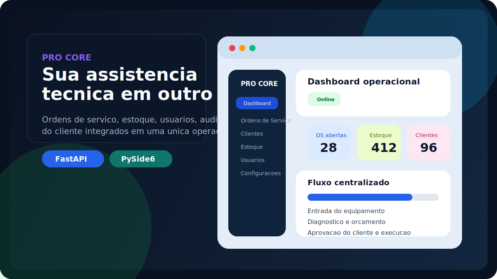
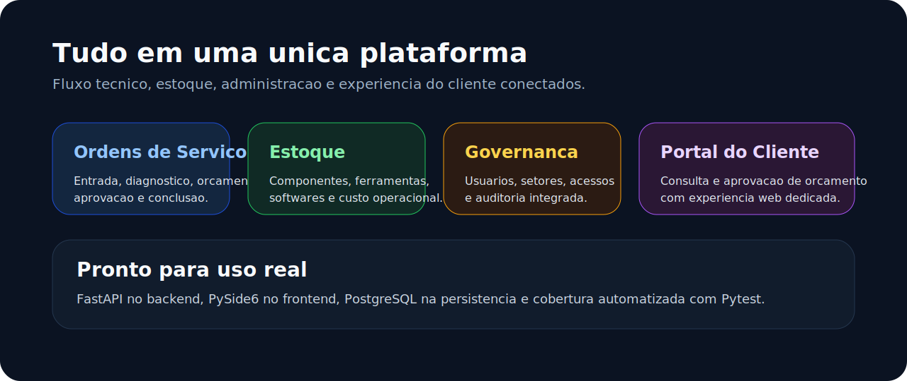

<p align="center">
	
</p>

<p align="center">
	
	
	
	
</p>

<h1 align="center">PRO CORE</h1>

<p align="center"><strong>A plataforma que transforma assistencia tecnica em uma operacao profissional, rastreavel e pronta para crescer.</strong></p>

<p align="center">
	PRO CORE e um sistema desktop com backend FastAPI e frontend PySide6 criado para empresas de assistencia tecnica que precisam unir atendimento, bancada, estoque, governanca e relacionamento com o cliente em uma unica operacao.
</p>

<p align="center">
	Da entrada do equipamento ao fechamento da ordem de servico, o sistema concentra operacao, indicadores, administracao, auditoria e experiencia do cliente em um unico produto.
</p>

## Impacto Imediato

- Centraliza ordens de servico, clientes, equipamentos, estoque e administracao.
- Eleva a imagem profissional da empresa com uma operacao mais organizada.
- Reduz retrabalho com validacoes, fluxos guiados e historico operacional.
- Entrega visibilidade sobre backlog, pendencias, estoque e performance.
- Melhora a experiencia do cliente com portal web para consulta e aprovacao de orcamento.

## O Que o PRO CORE Vende Na Pratica

### Produtividade operacional

- Fluxo completo de ordens de servico com entrada, diagnostico, orcamento, aprovacao, execucao e conclusao.
- Dashboard com indicadores e alertas para leitura rapida da operacao.
- Cadastro de clientes, equipamentos, objetos vinculados e componentes em um unico ecossistema.

### Controle de estoque e bancada

- Estoque com submodulos de componentes, ferramentas e softwares.
- Cadastro assistido em etapas para reduzir falhas de preenchimento.
- Controle de quantidade, custo, nivel minimo e contexto tecnico.

### Governanca e seguranca

- Usuarios, setores, acessos por modulo e solicitacoes de senha.
- Auditoria de acoes sensiveis.
- Backup operacional integrado e reinicio seguro do backend com autorizacao administrativa.
- Validacao de payloads, isolamento de anexos por empresa e protecoes HTTP no backend.

## Visao do Produto

<p align="center">
	
</p>

## Diferenciais

| Area | Valor entregue |
| --- | --- |
| Operacao tecnica | Fluxo real de atendimento, diagnostico, aprovacao e conclusao |
| Estoque | Controle de itens, custo e disponibilidade com contexto tecnico |
| Administracao | Usuarios, setores, recursos, auditoria e configuracoes centralizadas |
| Experiencia | Tema, idioma, escala visual e identidade por empresa |
| Cliente final | Portal web para acompanhar e decidir sobre orcamentos |

## Ideal Para

- Assistencias tecnicas que querem sair de planilhas e controles paralelos.
- Empresas em crescimento que precisam de padrao operacional.
- Equipes que querem rastreabilidade, seguranca e mais previsibilidade.
- Operacoes que precisam unir comercial, bancada e estoque sem fragmentacao.

## Recursos Principais

- Ordens de servico com status, diagnostico, aprovacao, orcamento e conclusao.
- Cadastro e historico de clientes.
- Gestao de equipamentos, placas, componentes e documentos.
- Estoque com fluxo assistido e estrutura tecnica.
- Ferramentas e especialidades por perfil de acesso.
- Usuarios, setores e controle dinamico de recursos.
- Auditoria operacional e administrativa.
- Backup manual integrado na interface.
- Portal do cliente para consulta e aprovacao de orcamento.

## Stack Tecnica

| Camada | Tecnologia |
| --- | --- |
| Backend | Python + FastAPI |
| Frontend | PySide6 |
| Banco de dados | PostgreSQL |
| Migracoes | Alembic |
| Infra local | Docker Compose |
| Testes | Pytest |

## Seguranca e Confiabilidade

- Autenticacao por token com controle de acesso por perfil.
- Permissoes por papel, modulo e contexto operacional.
- Troca obrigatoria de senha no primeiro acesso quando aplicavel.
- Upload de documentos com validacao de extensao e tamanho.
- Rate limiting em rotas sensiveis.
- Cabecalhos de seguranca HTTP e CSP ativo.
- Tratamento de erro de ponta a ponta com mensagens amigaveis no frontend.
- Suites automatizadas para backend e frontend.

## Como Rodar Localmente

### 1. Preparar o ambiente

```powershell
python -m venv .venv
.\.venv\Scripts\Activate.ps1
python -m pip install --upgrade pip
python -m pip install -e ".[dev]"
```

### 2. Subir o PostgreSQL

```powershell
docker compose up -d postgres
```

### 3. Aplicar migracoes

```powershell
alembic upgrade head
```

### 4. Criar o administrador inicial

```powershell
python scripts/create_initial_admin.py --company-name "Minha Assistencia" --admin-name "Administrador" --email admin@example.com --password "ChangeMe123"
```

### 5. Iniciar o backend

```powershell
uvicorn backend.app.main:app --reload
```

### 6. Iniciar o frontend

```powershell
python frontend/app/main.py
```

## Backup e Restauracao

- Backup manual disponivel pela interface em Configuracoes.
- Destino padrao de dumps em `backups`.
- Anexos armazenados em `storage/uploads`.
- Restauracao local por script:

```powershell
python scripts/restore_database_backup.py --dump-file .\backups\pro_core_YYYYMMDD_HHMMSS.dump
```

## Testes

### Suite completa

```powershell
pytest
```

### Validacoes focadas

```powershell
pytest backend/tests/test_commercial_workflow_routes.py backend/tests/test_app_health.py -q
pytest frontend/tests/test_dashboard_window.py frontend/tests/test_dashboard_window_settings.py frontend/tests/test_api_client.py -q
```

## Idiomas e Aparencia

- Portugues do Brasil (`pt-BR`)
- English (United States) (`en-US`)
- Tema claro e escuro
- Paletas configuraveis por empresa
- Escala visual ajustavel

## Referencias

- Estrategia de testes em [docs/testing_strategy.md](docs/testing_strategy.md)
- Analise de design e escopo em [docs/reference_design_gap_analysis.md](docs/reference_design_gap_analysis.md)

## Fechamento

PRO CORE foi desenhado para empresas que querem parar de administrar a assistencia tecnica no improviso e passar a operar com mais controle, mais imagem profissional e mais capacidade de crescimento.

Se a meta e vender melhor, executar com mais consistencia e dar mais visibilidade ao cliente e ao time interno, este projeto foi construido exatamente para isso.
